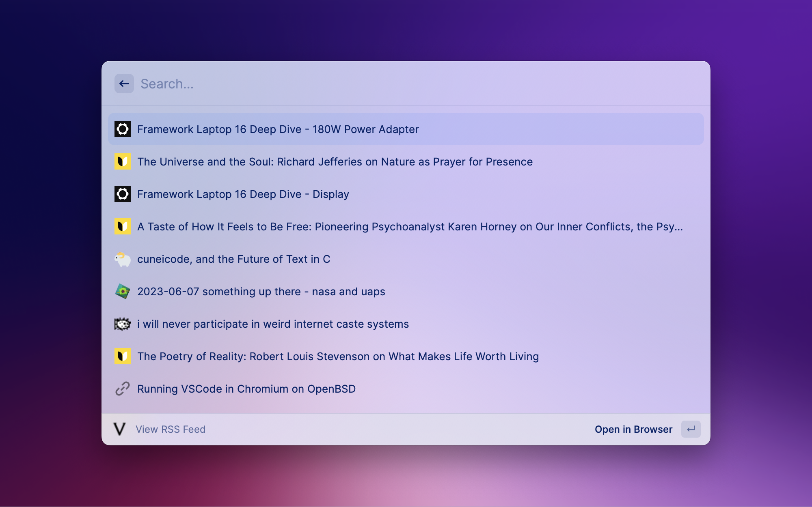
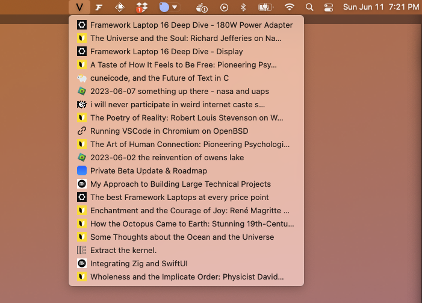

# Vore RSS

A simple RSS reader using vore.website that only shows today's posts.

1. (optional) Create an account https://vore.website/
2. Enter a username in the preferences area

Note: I'll probably wait and see if j3s will add pagination before submitting this to the Raycast store. If you watch a lot of feeds though the payload could end up massive. Otherwise this works fine.

